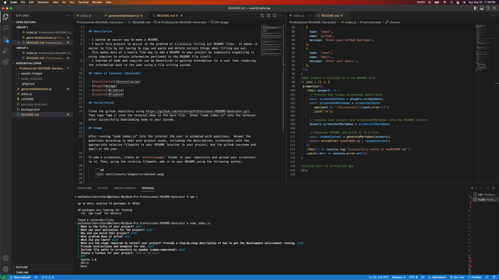

# Professional README Generator

## Description

- I wanted an easier way to make a README.
- I built this project to assist in the problem of tirelessly filling out README files.  It makes it easier to file by not having to copy and paste and delete certain things when filling one out.
- This makes more of a hassle free way to add a README to your project by seamlessly organizing it using inquirer to attain information pertinent to the README file itself.
- I learned of node and inquirer can be beneficial in gaining information for a user then rendering the information back to the user using a file writing system.

## Table of Contents (Optional)

- [Installation](#installation)
- [Usage](#usage)
- [License](#license)

## Installation

Clone the github repository using https://github.com/hershrva/Professional-README-Generator.git.  Then type "npm i" into the terminal when in the main file.  Enter "node index.js" into the terminal after successfully downloading node to your system.  

## Usage

After running "node index.js" into the terminal the user is prompted with questions. (Screenshot 1)  Answer the questions according to what your project needs, including the description, screenshots with the appropriate relative filepaths to your README location in your project, and the github username and email of the user.  It will then render the README file with the appropriate information. (Screenshot 2)

## License

This Project is available under the MIT license. See the LICENSE file for more info.

